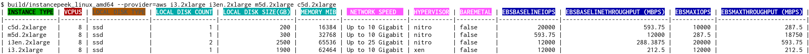

## instancepeek

instancepeek is a cli tool that aids in displaying and comparing properties of instance types on various cloud vendors.

If you ever needed to compare properties like local disk size or number of cpus across different instances, `instancepeek` may be of use to you.

At the moment `instancepeek` supports only AWS, but will be expanded soon to cover Google Cloud and Azure.

## Prequisites

### Building

You don't need to build the tool, you can download the latest artifacts.
If you want to build from source, clone this repository, ensure you have a recent version of Go installed (1.13 or later) and issue `make build`.
Artifacts will be built under `build/`.

### Authentication

As `instancepeek` leverages official APIs to pull the necessary instance details, you need be properly authenticated for each environment.

#### AWS

You need the same kind of configuration that you'd do for the [awscli tool](https://docs.aws.amazon.com/cli/latest/userguide/cli-configure-quickstart.html).
If you've configured a non default profile under `~/.aws/config`/`~/.aws/credentials`, ensure you've speficied the profile with `export AWS_PROFILE=<profile-name>`.

## Limitations

You can only specify the `aws` (or `dummy`, for testing) provider for now.
Stay tuned for support of more providers.

## Executing

Example invocation:

`./instancepeek_linux_amd64 --provider=aws i3.2xlarge i3en.2xlarge m5d.2xlarge c5d.2xlarge`

